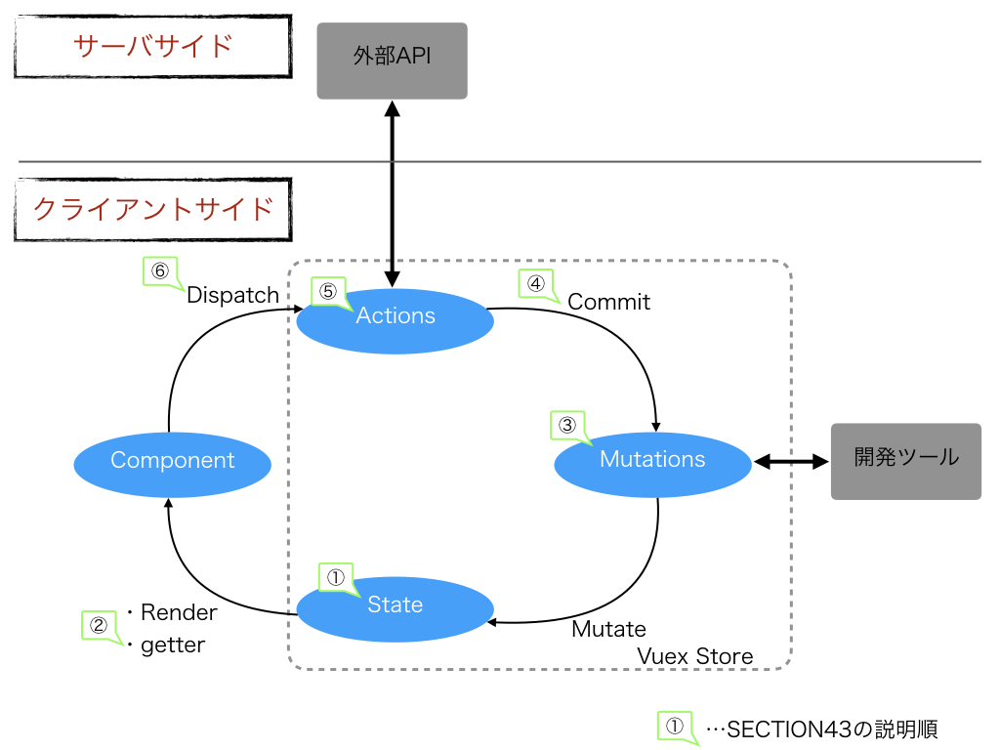

# CHAPTER8 Vuexでアプリケーションの状態を管理する

## *はじめに*

### *注意事項*

- *このリポジトリは[[秋葉原] 基礎から学ぶVue.js 輪読会(Vuex + VueRouter)](https://weeyble-js.connpass.com/event/100388/)の発表資料として用意したリポジトリです。*
- *書籍の要約は正体、担当者の理解で書いているところは斜体で記載しています。*
- *「サンプルあり」と記載のある箇所は、サンプルを動かしながら説明します。*
- *権利関係で問題があれば、対応するのでご指摘ください。*
- *各SECTIONのサンプルプログラムについて、（中身は十分理解できてませんが）とりあえずエラーが出ない状態まで実装したつもりなので、書籍の内容で不明点があれば、このリポジトリを参照してください。コミットログを見てもらえば、どこコミットでどのSECTIONの内容を実装しているかだいたいわかると思います。*

-------------------

## SECTION41 Vuexとは

- Vuexとは、データとその状態(state)を管理する**状態管理のための拡張ライブラリ**。
- CHAPTER5「コンポーネントでUI部品を作る」でコンポーネント間のデータのやり取りの仕方を学んだ。シンプルなアプリケーションはCHAPTER5の内容で十分だが、コンポーネントを構造化したりアプリケーションの規模が大きくなると管理が難しくなってくる。
- Vuexを導入することで、面倒なデータ管理から解放される。加えて、整合性も保ちやすくなる。
- 

### Vuexを導入するメリット

- CHAPTER5の内容は特定のコンポーネント間の局所的なデータのやり取りだった。
- 対してVuexは特定のコンポーネント間だけでなく、アプリケーション全体でデータを共有する。
- P.154の図とP.253の図を見比べるとイメージしやすい。（*⌘＋Gで157、その後⌘＋Gで252*）

### Vuexのインストール

- 省略
- インストール時のログは[ここ](https://github.com/yasugahira0810/vuejs_chapter8/blob/master/install.log)にあるので、もしインストール時にエラーが出た時は参考にしてください。

### *補足*

- *本章を読み進める上で、[Vuex入門](https://vuex.vuejs.org/ja/guide/)の冒頭も参考になるので引用する*

*Vuex アプリケーションの中心にあるものはストアです。"ストア" は、基本的にアプリケーションの 状態（state） を保持するコンテナです。単純なグローバルオブジェクトとの違いが 2つあります。*

*1. Vuex ストアはリアクティブです。Vue コンポーネントがストアから状態を取り出すとき、もしストアの状態が変化したら、ストアはリアクティブかつ効率的に更新を行います。*

*2. ストアの状態を直接変更することはできません。明示的にミューテーションをコミットすることによってのみ、ストアの状態を変更します。これによって、全ての状態の変更について追跡可能な記録を残すことが保証され、ツールでのアプリケーションの動作の理解を助けます。*

- *以降の節ではずっとストアの話が続くが、少なくとも本節を読む上ではVuexとほぼ同じものと捉えてよさそう。*
- *グローバルオブジェクトとの違いの2点目は、Fluxアーキテクチャのことを示しているっぽい。（よくわかっていない）*

-------------------

## SECTION42 シンプルなストア構造

- [コード](https://github.com/yasugahira0810/VueChapter8App/tree/0b769237ae1ca685074b915875cfc21f2e31bbf2)
- *コードの中身は次節で説明するので省略。画面は無しで、コンソールログに0と1が出力されるはず。*

### ストアをVueアプリケーションに登録する

- 省略。

### Vuex内のインスタンスの参照方法

- Vue.js本体はthisを使う。*P.60参照。メソッド内ではプロパティ名にthisをつける必要があって、このthisはインスタンスを指すという話があった。*
- それに対してVuexのインスタンスはthisは使わず、プロパティやメソッドは引数として渡す。そのためメソッド定義にもアロー関数を使用できる。

-------------------

## SECTION43 コアコンセプト

### 補足

- *P.258の図を理解することが本節で一番重要な気がする。*
- *WEB+DB PRESS Vol106の「仮想DOM革命」という記事に仮想DOMやFluxアーキテクチャのことが書いてあっ他ので、（難しくて理解が曖昧だが）その内容を踏まえて補足する。*
- *P.258の図に、公式ドキュメントとWEB+DB PRESSの記事を併せて、自分なりの理解として図示したのが下の図。*

- *この図で大事なのはComponentがStateを更新したい場合、直接Stateを更新することはできず、間にあるActionsとMutationsを介さないといけないということっぽい。*
- *StateとComponentを双方向に通信させず、ComponentがStateを更新する場合はActionsとMutationsを介すアーキテクチャを取ることで、状態管理が複雑になる問題を解消しているらしい。*
- *Fluxというアーキテクチャが登場するまでは、サーバサイドMVCをクライアント側に適用したクライアントサイドMVCというアーキテクチャが使われていたが、この状態管理の複雑さが深刻な問題だったっぽい。*
- *図のようなアーキテクチャを単方向データフローというらしい。*

### ステート（state）

- ストアで管理している状態そのもの。
- コンポーネントでいうところのdata。

### ゲッター（getter）

- stateを取得するための算出データ。
- コンポーネントでいうところのcomputed(算出プロパティ)とmethodsの中間のような機能。
- 算出プロパティとの違い
  + 引数を渡せる
  + セッター機能なし
  + 定義するメソッドの引数として使用できるプロパティやメソッドが受け取れる
- getterを介さず直接stateにアクセスすることもできるが、混乱を避けるため常にゲッターを介すのがおすすめ。（*やろうとすれば直接stateにアクセスできちゃうの？？？*）

### ミューテーション（mutations）

- ステートを変更できる唯一のメソッド。
- コンポーネントでいうところのmethods。
- ミューテーションおよびアクションのメソッドは「タイプ」と呼ばれる。

#### コミット

- ミューテーションを明示的に呼び出すための特別なメソッド。
- 登録されているミューテーションを呼び出すインスタンスメソッド。
- コンポーネントでいうところの$emitに似ている。

### アクション（actions）

- 非同期処理を含めることのできるメソッド。
- データの加工や非同期処理を行い、その結果をミューテーションへコミットする。

#### ディスパッチ（dispatch）

- アクションを明示的に呼び出すための特別なメソッド。
- 登録されているアクションを呼び出すインスタンスメソッド。
- 別のアクション内からも使用できる。
- 非同期処理がなければアクションを介さず、直接コミットすることもできるが、混乱を避けるためすべてdispatchに統一するのがおすすめ。

### Vuexのルール

- Vuexが提供するルールに従って状態管理の定義と更新をすることで、保守性を向上できる。
  + アプリケーションレベルの状態はストアで管理する
  + 状態を変更できるのはミューテーション内のみ
  + 非同期処理はコミットする前に済ませておく

-------------------

## SECTION44 コンポーネントでストアを使用しよう

- 資料未作成のため、口頭で説明予定。

-------------------

## SECTION45 モジュールで大きくなったストアを分割する

- 資料未作成のため、口頭で説明予定。

-------------------

## SECTION46 その他のストアやオプション

- 資料未作成のため、口頭で説明予定。

-------------------
